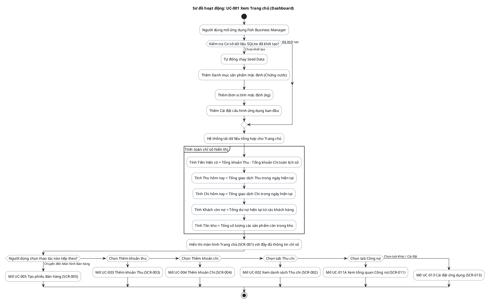

# AD-001 — Sơ đồ hoạt động: UC-001 Xem Trang chủ (Dashboard)

> Version: 2.0
>
> Last Updated: 30/07/2026

---

## Mô tả Use Case

- **Tên Use Case**: UC-001 Xem Trang chủ (Dashboard)
- **Actor**: Chủ cửa hàng
- **Mục đích**: Tổng hợp và hiển thị tức thì các chỉ số tài chính quan trọng (Tiền hiện có, Thu hôm nay, Chi hôm nay, Khách còn nợ, Tồn kho) ngay khi mở ứng dụng.

---

## Sơ đồ hoạt động PlantUML

---

## Dữ liệu hiển thị

| Thành phần | Bảng dữ liệu nguồn | Công thức / Điều kiện |
|------------|---------------------|------------------------|
| Tiền hiện có | `transactions` | SUM(amount WHERE transaction_type='income') - SUM(amount WHERE transaction_type='expense') |
| Thu hôm nay | `transactions` | SUM(amount) WHERE transaction_type='income' AND transaction_date=Today |
| Chi hôm nay | `transactions` | SUM(amount) WHERE transaction_type='expense' AND transaction_date=Today |
| Khách còn nợ | `customer_balances` | SUM(current_debt) WHERE current_debt > 0 |
| Tồn kho | `inventory_entries` | Tổng biến động kho theo sản phẩm |
