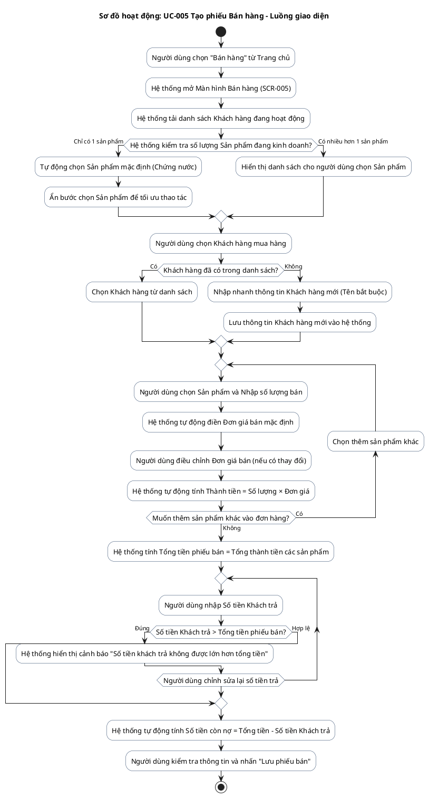

# AD-002 — Sơ đồ hoạt động: UC-005 Tạo phiếu Bán hàng (Sale)

> Version: 2.0
>
> Last Updated: 30/07/2026

---

## Mô tả Use Case

- **Tên Use Case**: UC-005 Tạo phiếu Bán hàng
- **Actor**: Chủ cửa hàng
- **Mục đích**: Lập phiếu bán hàng cho khách, tự động trừ tồn kho, tính tiền khách trả, ghi nhận công nợ (nếu trả thiếu) và lưu tất cả trong một Database Transaction duy nhất (BR-404).

---

## Sơ đồ hoạt động PlantUML — Luồng giao diện & Nhập liệu

---

## Sơ đồ hoạt động PlantUML — Luồng xử lý dữ liệu (Database Transaction)

```plantuml
@startuml
title Sơ đồ hoạt động: UC-005 Tạo phiếu Bán hàng - Luồng Ghi dữ liệu (DB Transaction)

skinparam ActivityBackgroundColor #FFFFFF
skinparam ActivityBorderColor #1A365D
skinparam ActivityFontName Arial
skinparam ActivityFontSize 13

start
:Nhận yêu cầu Lưu phiếu Bán hàng;

partition "Kiểm tra hợp lệ (Validation)" {
  if (Khách hàng đã được chọn?) then (Không)
    :Hiển thị lỗi "Chưa chọn khách hàng";
    stop
  else (Có)
  endif

  if (Đơn hàng có ít nhất 1 sản phẩm?) then (Không)
    :Hiển thị lỗi "Đơn hàng phải có ít nhất 1 sản phẩm";
    stop
  else (Có)
  endif

  if (Số lượng > 0 và Đơn giá >= 0?) then (Không)
    :Hiển thị lỗi "Số lượng hoặc đơn giá không hợp lệ";
    stop
  else (Có)
  endif

  if (Tồn kho của từng sản phẩm có đủ để bán?) then (Không đủ)
    :Hiển thị lỗi "Số lượng tồn kho không đủ để bán";
    stop
  else (Đủ hàng)
  endif
}

partition "Database Transaction (BR-404)" {
  :Mở Database Transaction trong SQLite;

  :Thêm bản ghi mới vào bảng sale_documents;
  if (Thêm sale_documents thành công?) then (Có)
  else (Thất bại)
    goto rollback_label
  endif

  :Thêm các bản ghi chi tiết vào bảng sale_items;
  if (Thêm sale_items thành công?) then (Có)
  else (Thất bại)
    goto rollback_label
  endif

  :Thêm bản ghi giảm kho vào bảng inventory_entries (entry_type = 'sale');
  if (Thêm inventory_entries thành công?) then (Có)
  else (Thất bại)
    goto rollback_label
  endif

  if (Số tiền Khách trả > 0?) then (Có)
    :Thêm bản ghi thu tiền vào bảng transactions (transaction_type = 'income');
    if (Thêm transactions thành công?) then (Có)
    else (Thất bại)
      goto rollback_label
    endif
  else (Không)
  endif

  if (Số tiền Còn nợ > 0?) then (Có)
    :Thêm bản ghi công nợ vào bảng debt_transactions (change_type = 'increase');
    if (Thêm debt_transactions thành công?) then (Có)
    else (Thất bại)
      goto rollback_label
    endif

    :Cập nhật dư nợ tăng trong bảng customer_balances;
    if (Cập nhật customer_balances thành công?) then (Có)
    else (Thất bại)
      goto rollback_label
    endif
  else (Không)
  endif

  :COMMIT Database Transaction;
  :Hệ thống hiển thị thông báo "Đã lưu phiếu bán thành công";
  if (Khách còn nợ?) then (Có)
    :Hiển thị thông báo "Khách còn nợ: X đồng";
  else (Không)
  endif
  :Quay về màn hình Trang chủ (SCR-001);
  stop

  label rollback_label
  :ROLLBACK toàn bộ Database Transaction;
  :Hiển thị lỗi "Không thể lưu dữ liệu, hệ thống đã hoàn tác";
  stop
}
@enduml
```

---

## Quy tắc nghiệp vụ liên quan

| Quy tắc | Mô tả quy tắc |
|---------|---------------|
| BR-401 | Một phiếu bán phải có ít nhất một sản phẩm |
| BR-402 | Không cho phép số lượng bằng 0 hoặc âm |
| BR-403 | Không cho phép đơn giá âm |
| BR-404 | Tất cả các bước lưu dữ liệu bán hàng phải nằm trong 1 Database Transaction duy nhất |
| BR-802 | Không cho phép bán vượt số lượng tồn kho |
