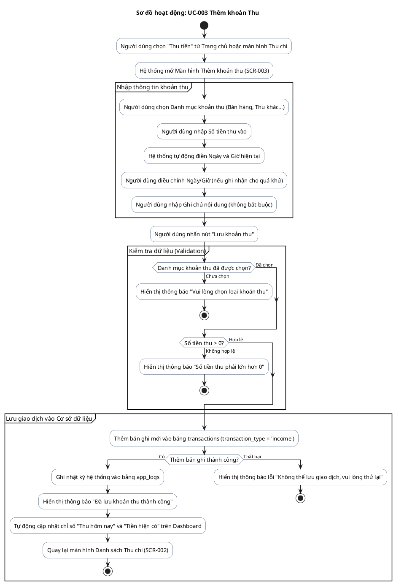

# AD-003 — Sơ đồ hoạt động: UC-003 Thêm khoản Thu (Income)

> Version: 2.0
>
> Last Updated: 30/07/2026

---

## Mô tả Use Case

- **Tên Use Case**: UC-003 Thêm khoản Thu
- **Actor**: Chủ cửa hàng
- **Mục đích**: Ghi nhận một khoản tiền thu vào tài khoản/quỹ của cửa hàng (không phải thu nợ từ khách hàng).

---

## Sơ đồ hoạt động PlantUML

---

## Quy tắc nghiệp vụ liên quan

| Quy tắc | Mô tả quy tắc |
|---------|---------------|
| BR-501 | Mỗi lần thu tiền đều tạo một giao dịch mới, không ghi đè lên giao dịch cũ |
| BR-603 | Không cho phép số tiền thu nhỏ hơn hoặc bằng 0 |
| BR-003 | Mọi giao dịch đều hỗ trợ ghi chú để dễ tra cứu |
