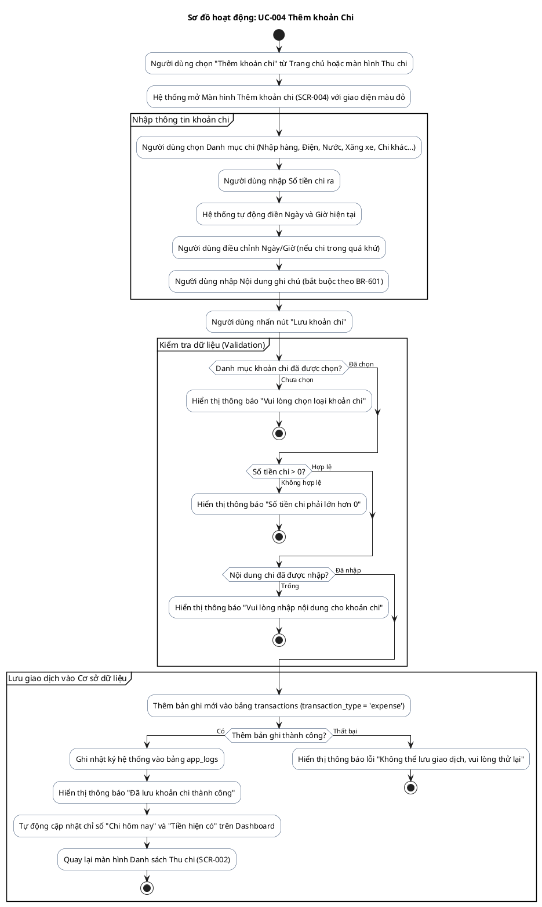

# AD-004 — Sơ đồ hoạt động: UC-004 Thêm khoản Chi (Expense)

> Version: 2.0
>
> Last Updated: 30/07/2026

---

## Mô tả Use Case

- **Tên Use Case**: UC-004 Thêm khoản Chi
- **Actor**: Chủ cửa hàng
- **Mục đích**: Ghi nhận một khoản chi tiêu của cửa hàng (tiền mua hàng, tiền điện, nước, xăng xe, chi phí nuôi cá...).

---

## Sơ đồ hoạt động PlantUML

---

## Quy tắc nghiệp vụ liên quan

| Quy tắc | Mô tả quy tắc |
|---------|---------------|
| BR-601 | Mọi khoản chi đều phải có: Loại chi, Số tiền, Ngày, Nội dung |
| BR-602 | Các loại chi được quản lý theo danh mục |
| BR-603 | Không cho phép số tiền chi nhỏ hơn hoặc bằng 0 |
