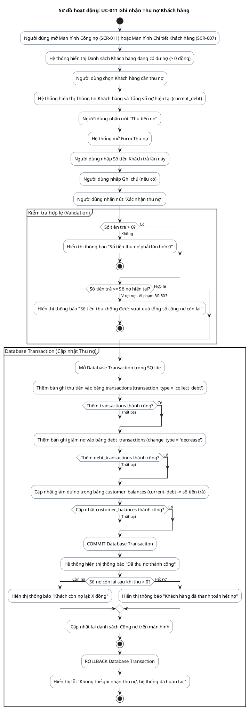

# AD-005 — Sơ đồ hoạt động: UC-011 Ghi nhận Thu nợ Khách hàng (Debt Collection)

> Version: 2.0
>
> Last Updated: 30/07/2026

---

## Mô tả Use Case

- **Tên Use Case**: UC-011 Ghi nhận Thu nợ Khách hàng
- **Actor**: Chủ cửa hàng
- **Mục đích**: Ghi nhận việc khách hàng thanh toán tiền nợ cũ. Tự động giảm dư nợ khách hàng, tạo lịch sử nợ và sinh giao dịch thu tiền vào sổ cái.

---

## Sơ đồ hoạt động PlantUML

---

## Quy tắc nghiệp vụ liên quan

| Quy tắc | Mô tả quy tắc |
|---------|---------------|
| BR-501 | Mỗi lần thu tiền đều tạo một giao dịch mới, không ghi đè |
| BR-502 | Một khách hàng có thể trả nhiều lần cho cùng một phiếu bán hoặc khoản nợ |
| BR-503 | Không được thu vượt quá số công nợ còn lại |
| BR-702 | Mọi thay đổi công nợ đều phải lưu lịch sử trong `debt_transactions` |
| BR-703 | Số dư công nợ `customer_balances` chỉ là dữ liệu tổng hợp |
