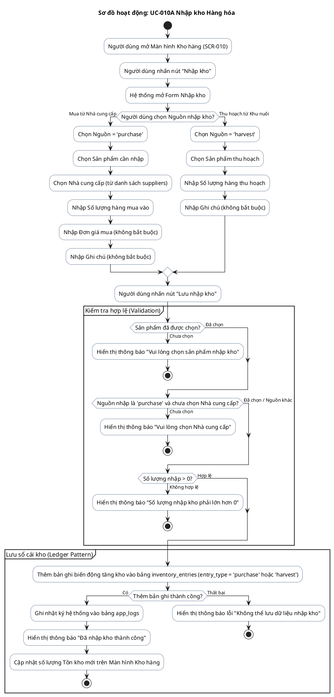

# AD-006 — Sơ đồ hoạt động: UC-010A Nhập kho Hàng hóa (Inventory Import)

> Version: 2.0
>
> Last Updated: 30/07/2026

---

## Mô tả Use Case

- **Tên Use Case**: UC-010A Nhập kho Hàng hóa
- **Actor**: Chủ cửa hàng
- **Mục đích**: Ghi nhận số lượng hàng hóa (Chứng nước / sản phẩm khác) tăng thêm vào kho từ hai nguồn: Mua từ Nhà cung cấp hoặc Thu hoạch từ Khu nuôi cá gia đình.

---

## Sơ đồ hoạt động PlantUML

---

## Quy tắc nghiệp vụ liên quan

| Quy tắc | Mô tả quy tắc |
|---------|---------------|
| BR-801 | Kho được quản lý theo Ledger. Chỉ thêm bản ghi mới, không sửa lịch sử |
| BR-803 | Các nguồn nhập kho gồm: Mua từ nhà cung cấp (`purchase`), Tự sản xuất (`harvest`), Điều chỉnh (`adjustment`) |
| BR-804 | Mọi thay đổi kho đều phải ghi rõ: Loại biến động, Sản phẩm, Số lượng, Thời gian |
