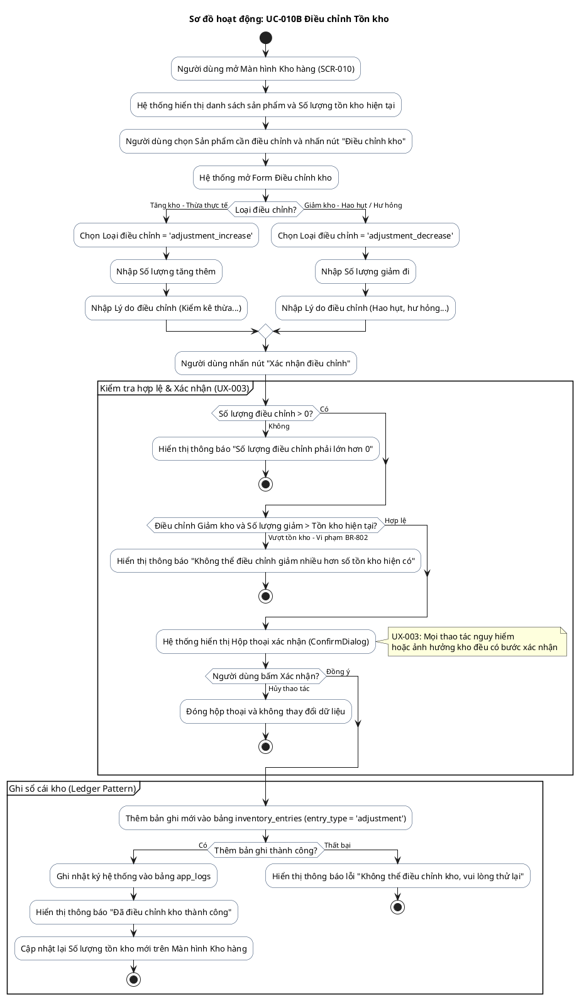

# AD-007 — Sơ đồ hoạt động: UC-010B Điều chỉnh Tồn kho (Inventory Adjustment)

> Version: 2.0
>
> Last Updated: 30/07/2026

---

## Mô tả Use Case

- **Tên Use Case**: UC-010B Điều chỉnh Tồn kho
- **Actor**: Chủ cửa hàng
- **Mục đích**: Cân bằng số lượng kho trên ứng dụng với số lượng kiểm kê thực tế khi có hao hụt, hư hỏng hoặc sai lệch. Ghi bản ghi điều chỉnh mới vào sổ cái kho (Ledger Pattern).

---

## Sơ đồ hoạt động PlantUML

---

## Quy tắc nghiệp vụ liên quan

| Quy tắc | Mô tả quy tắc |
|---------|---------------|
| BR-801 | Kho được quản lý theo Ledger. Không sửa lịch sử cũ, chỉ ghi bản ghi điều chỉnh mới |
| BR-802 | Không cho phép tồn kho âm |
| BR-804 | Mọi thay đổi kho đều phải ghi rõ loại biến động, sản phẩm, số lượng, thời gian và lý do |
| UX-003 | Thao tác điều chỉnh kho phải có bước xác nhận |
