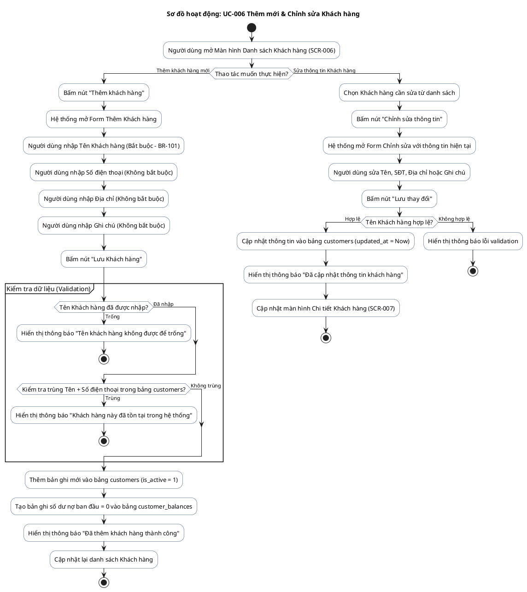
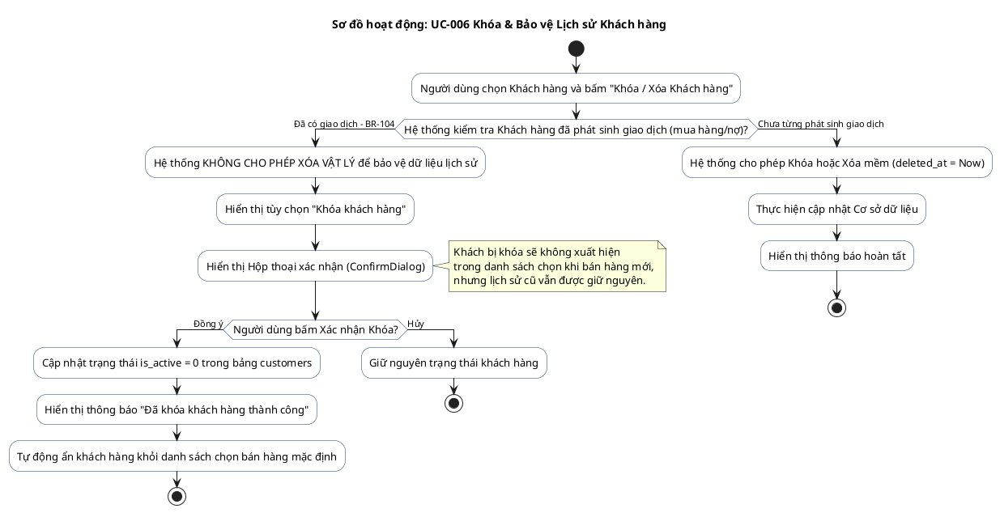

# AD-008 — Sơ đồ hoạt động: UC-006 & UC-007 Quản lý Khách hàng (Customer Management)

> Version: 2.0
>
> Last Updated: 30/07/2026

---

## Mô tả Use Case

- **Tên Use Case**: UC-006 Danh sách Khách hàng & UC-007 Chi tiết Khách hàng
- **Actor**: Chủ cửa hàng
- **Mục đích**: Quản lý thông tin người mua hàng: xem danh sách, thêm khách hàng mới, sửa thông tin, xem chi tiết lịch sử mua bán/thanh toán và khóa khách hàng khi ngưng giao dịch.

---

## Sơ đồ hoạt động PlantUML — Thêm mới & Sửa Khách hàng

---

## Sơ đồ hoạt động PlantUML — Khóa / Xóa Khách hàng (BR-103 & BR-104)

---

## Quy tắc nghiệp vụ liên quan

| Quy tắc | Mô tả quy tắc |
|---------|---------------|
| BR-101 | Tên khách hàng là bắt buộc. Điện thoại, địa chỉ, ghi chú không bắt buộc |
| BR-102 | Được phép sửa thông tin bất cứ lúc nào, không ảnh hưởng lịch sử mua bán |
| BR-103 | Khi bị khóa: Không xuất hiện trong danh sách chọn bán hàng mới, lịch sử được giữ nguyên |
| BR-104 | Khách hàng đã phát sinh giao dịch KHÔNG được xóa khỏi hệ thống. Chỉ được khóa |
