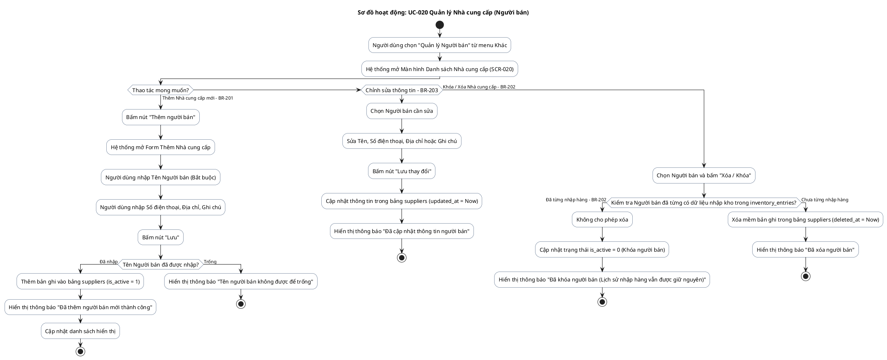

# AD-009 — Sơ đồ hoạt động: UC-020 Quản lý Nhà cung cấp / Người bán (Supplier Management)

> Version: 2.0
>
> Last Updated: 30/07/2026

---

## Mô tả Use Case

- **Tên Use Case**: UC-020 Quản lý Nhà cung cấp (Người bán)
- **Actor**: Chủ cửa hàng
- **Mục đích**: Quản lý danh sách nơi mua chứng nước và vật tư. Toàn bộ dữ liệu do Chủ cửa hàng tự nhập thủ công (Người bán không sử dụng ứng dụng).

---

## Sơ đồ hoạt động PlantUML

---

## Quy tắc nghiệp vụ liên quan

| Quy tắc | Mô tả quy tắc |
|---------|---------------|
| BR-201 | Nhà cung cấp được tạo hoàn toàn thủ công do người dùng nhập |
| BR-202 | Không được xóa nhà cung cấp nếu đã từng phát sinh nhập kho. Chỉ được khóa |
| BR-203 | Có thể chỉnh sửa thông tin nhà cung cấp bất cứ lúc nào |
