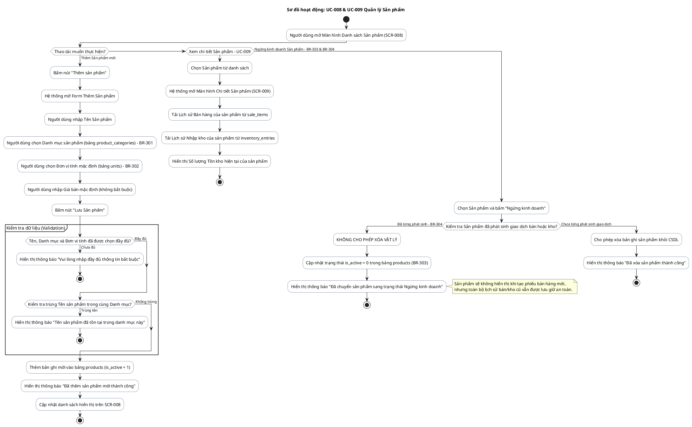

# AD-010 — Sơ đồ hoạt động: UC-008 & UC-009 Quản lý Sản phẩm (Product Management)

> Version: 2.0
>
> Last Updated: 30/07/2026

---

## Mô tả Use Case

- **Tên Use Case**: UC-008 Danh sách Sản phẩm & UC-009 Chi tiết Sản phẩm
- **Actor**: Chủ cửa hàng
- **Mục đích**: Quản lý danh mục sản phẩm kinh doanh (Chứng nước, Cá giống, Thức ăn, Thuốc, Vật tư), gắn Đơn vị tính tương ứng (kg, bao, con, thùng) và thiết lập Giá bán mặc định.

---

## Sơ đồ hoạt động PlantUML — Thêm mới & Quản lý Sản phẩm

---

## Quy tắc nghiệp vụ liên quan

| Quy tắc | Mô tả quy tắc |
|---------|---------------|
| BR-301 | Một sản phẩm thuộc đúng một danh mục (`product_categories`) |
| BR-302 | Một sản phẩm có một đơn vị tính mặc định (`units`) |
| BR-303 | Sản phẩm ngừng kinh doanh: Không xuất hiện khi bán mới, giữ nguyên lịch sử |
| BR-304 | Không được xóa sản phẩm đã từng phát sinh giao dịch bán hoặc kho |
