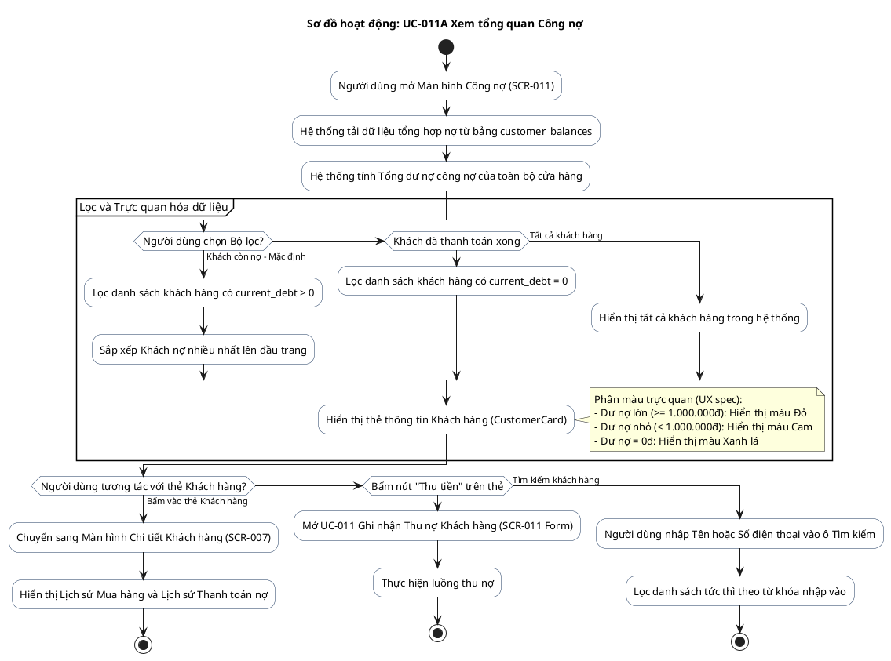

# AD-011 — Sơ đồ hoạt động: UC-011A Xem tổng quan Công nợ (Debt Overview)

> Version: 2.0
>
> Last Updated: 30/07/2026

---

## Mô tả Use Case

- **Tên Use Case**: UC-011A Xem tổng quan Công nợ
- **Actor**: Chủ cửa hàng
- **Mục đích**: Theo dõi danh sách khách hàng đang thiếu nợ, sắp xếp theo số nợ nhiều/ít, trực quan hóa màu sắc (Đỏ = Nợ nhiều, Xanh = Đã thanh toán) để chủ cửa hàng quản lý thu nợ hiệu quả.

---

## Sơ đồ hoạt động PlantUML

---

## Quy tắc nghiệp vụ liên quan

| Quy tắc | Mô tả quy tắc |
|---------|---------------|
| BR-701 | Công nợ chỉ phát sinh khi khách chưa thanh toán đủ số tiền mua hàng |
| BR-702 | Mọi thay đổi công nợ đều phải lưu lịch sử trong `debt_transactions` |
| BR-703 | Bảng `customer_balances` lưu dư nợ hiện tại để hiển thị danh sách công nợ nhanh chóng |
