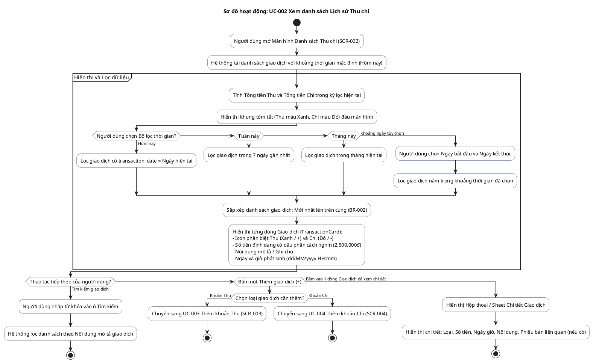

# AD-012 — Sơ đồ hoạt động: UC-002 Xem danh sách Lịch sử Thu chi (Transaction List)

> Version: 2.0
>
> Last Updated: 30/07/2026

---

## Mô tả Use Case

- **Tên Use Case**: UC-002 Xem danh sách Lịch sử Thu chi
- **Actor**: Chủ cửa hàng
- **Mục đích**: Tra cứu toàn bộ lịch sử các giao dịch thu tiền, chi tiền, thu nợ. Cho phép tìm kiếm theo từ khóa và lọc giao dịch theo mốc thời gian (Hôm nay, Tuần này, Tháng này, Khoảng ngày).

---

## Sơ đồ hoạt động PlantUML

---

## Quy tắc nghiệp vụ liên quan

| Quy tắc | Mô tả quy tắc |
|---------|---------------|
| BR-001 | Không cho phép xóa hoặc sửa trực tiếp các giao dịch thu chi lịch sử |
| BR-002 | Mọi giao dịch lưu ngày giờ chính xác và được sắp xếp mới nhất trước |
| BR-501 | Mỗi giao dịch thu/chi là một bản ghi độc lập |
