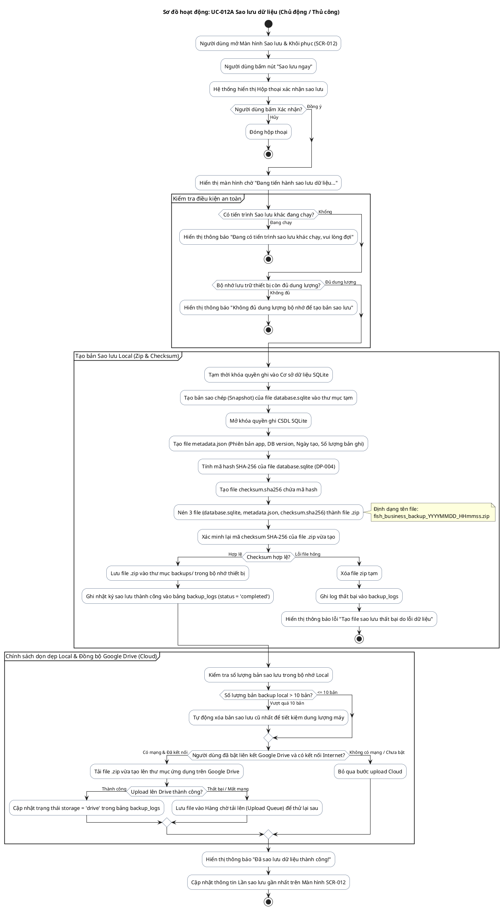

# AD-013 — Sơ đồ hoạt động: UC-012A Sao lưu dữ liệu (Backup)

> Version: 2.0
>
> Last Updated: 30/07/2026

---

## Mô tả Use Case

- **Tên Use Case**: UC-012A Sao lưu dữ liệu (Backup)
- **Actor**: Chủ cửa hàng / Tiến trình tự động hệ thống
- **Mục đích**: Nén toàn bộ cơ sở dữ liệu SQLite, tạo checksum SHA-256 xác thực tính toàn vẹn, lưu bản sao lưu ở bộ nhớ máy tính/điện thoại (Local) và tự động đồng bộ lên Google Drive (Cloud) nhằm bảo vệ dữ liệu chống mất mát (DP-001).

---

## Sơ đồ hoạt động PlantUML — Sao lưu thủ công

---

## Quy tắc nghiệp vụ liên quan

| Quy tắc | Mô tả quy tắc |
|---------|---------------|
| DP-001 | Không được làm mất dữ liệu do bất kỳ lỗi ứng dụng nào |
| DP-004 | File Backup phải được kiểm tra tính toàn vẹn (Checksum SHA-256) trước khi công nhận thành công |
| DP-005 | Không xóa bản Backup cũ nếu bản Backup mới chưa được tạo thành công hoàn toàn |
| Policy | Bộ nhớ Local giữ tối đa 10 bản sao lưu gần nhất. Google Drive giữ 30 bản gần nhất |
