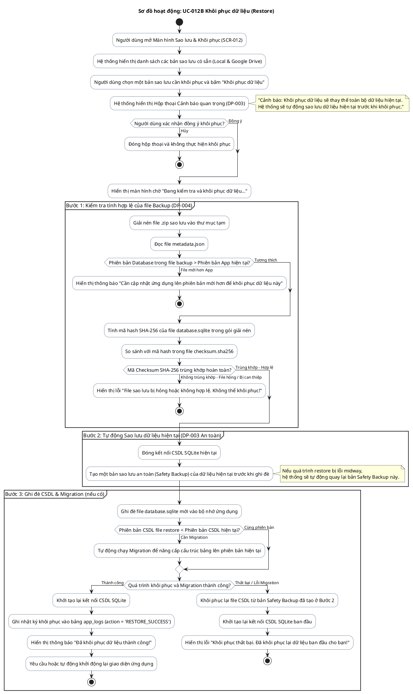

# AD-014 — Sơ đồ hoạt động: UC-012B Khôi phục dữ liệu (Restore)

> Version: 2.0
>
> Last Updated: 30/07/2026

---

## Mô tả Use Case

- **Tên Use Case**: UC-012B Khôi phục dữ liệu (Restore)
- **Actor**: Chủ cửa hàng
- **Mục đích**: Khôi phục lại toàn bộ dữ liệu kinh doanh từ một bản sao lưu (Local hoặc Google Drive) khi thay điện thoại mới hoặc cần khôi phục lại thời điểm cũ. Đảm bảo an toàn tuyệt đối bằng cách tự động sao lưu dữ liệu hiện tại trước khi thực hiện restore (DP-003).

---

## Sơ đồ hoạt động PlantUML

---

## Quy tắc nghiệp vụ liên quan

| Quy tắc | Mô tả quy tắc |
|---------|---------------|
| DP-003 | Restore không được ghi đè ngay lập tức. Luôn tự động tạo bản Backup dữ liệu hiện tại trước khi Restore |
| DP-004 | File Backup phải được kiểm tra tính toàn vẹn Checksum SHA-256 trước khi khôi phục |
| DP-001 | Bảo đảm tuyệt đối không làm mất dữ liệu người dùng khi khôi phục bị lỗi |
