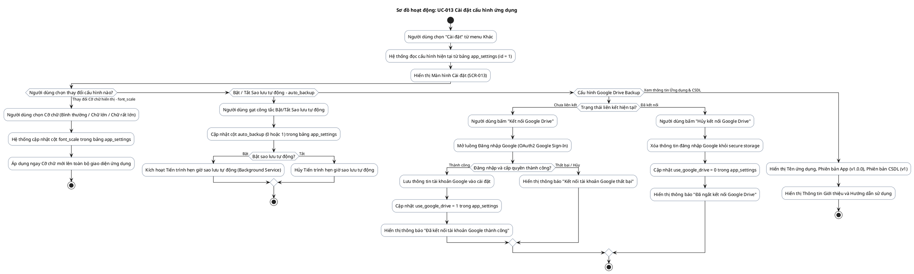

# AD-015 — Sơ đồ hoạt động: UC-013 Cài đặt ứng dụng (Settings)

> Version: 2.0
>
> Last Updated: 30/07/2026

---

## Mô tả Use Case

- **Tên Use Case**: UC-013 Cài đặt cấu hình ứng dụng
- **Actor**: Chủ cửa hàng
- **Mục đích**: Tùy chỉnh các thiết lập hệ thống: Cỡ chữ hiển thị (font_scale), Sao lưu tự động (auto_backup), Liên kết tài khoản Google Drive, Thời gian giữ bản sao lưu và xem thông tin phiên bản ứng dụng.

---

## Sơ đồ hoạt động PlantUML

---

## Quy tắc nghiệp vụ liên quan

| Quy tắc | Mô tả quy tắc |
|---------|---------------|
| DB Config | Bảng `app_settings` chỉ có duy nhất 1 dòng dữ liệu (`id = 1`) lưu cấu hình hệ thống |
| Accessibility | Phông chữ hỗ trợ phóng to (Font Scale) giúp người lớn tuổi dễ thao tác |
